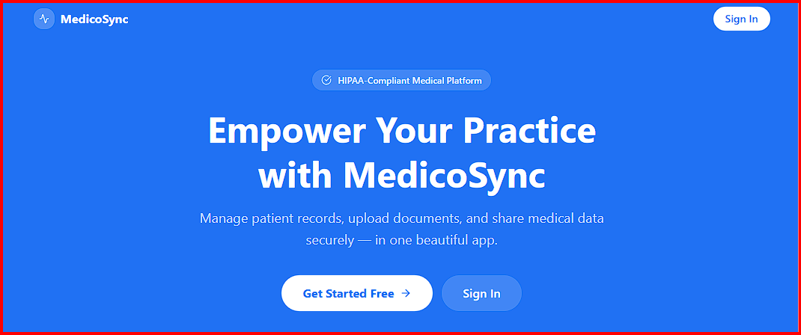

# MedicoSync


> **A production-grade, secure medical records portal for doctors.** Manage patients, upload clinical files to private cloud storage, and share records via OTP-verified, time-limited links — built on a strict 5-layer async architecture.

---

## 🚧 Current Project Status

Frontend under active development. Current focus: Completing dashboard views and optimizing state caching.

---

## 🔗 Live Links

| Service | URL |
|---|---|
| 🌐 Frontend App | [medicosync-frontend.netlify.app](https://medicosync-frontend.netlify.app) |
| ⚙️ Backend API Docs | [medicosync-backend.onrender.com/docs](https://medicosync-backend.onrender.com/docs) |
| 🗄️ Database | Supabase (PostgreSQL) |

> **Tip for reviewers:** The `/docs` endpoint is live Swagger UI. Every endpoint is testable directly from the browser — no Postman required.

---

## 📷 Preview


---

## ✅ Core Features

- **JWT Authentication** — Argon2 password hashing, 60-minute token expiry in production, `is_active` guard on every protected route.
- **Patient Management** — Full CRUD for patient records, isolated strictly by authenticated doctor identity.
- **Secure File Upload** — PDF, JPEG, and PNG uploads streamed directly to MinIO / AWS S3. S3 write confirmed before any database record is created.
- **Presigned URL Access** — Medical files live in a private S3 bucket. Access is granted via time-limited presigned URLs (1-hour expiry). Intercepted links are useless after expiry.
- **OTP-Verified Share Links** — Doctors share records via a unique token + 6-digit OTP sent through separate channels. OTP is hashed with HMAC-SHA256 + server secret. Max 3 wrong attempts before permanent link deactivation.
- **UUID Primary Keys** — All resource IDs are UUIDs, preventing sequential enumeration attacks on patient or record endpoints.
- **Atomic Race Condition Prevention** — OTP attempt counters increment via a single `UPDATE ... SET attempts = attempts + 1` query. No two concurrent threads can corrupt the attempt count.
- **Doctor Data Isolation** — Every patient and record query enforces `WHERE doctor_id = :current_doctor_id`, sourced exclusively from the signed JWT — never from the request body.
- **Fully Async** — SQLAlchemy 2.0 async ORM throughout. Non-blocking I/O from HTTP layer down to database queries.
- **30 Passing Tests** — Unit and integration tests covering authentication, patient CRUD, file upload flow, OTP verification, and share link lifecycle.

---

## 🏗️ Architecture & Technology Stack

### 5-Layer Request Architecture

Every request flows through exactly 5 layers. Each layer has one job.

```
Layer 1 → Router      → speaks HTTP only
Layer 2 → Controller  → owns flow and transactions
Layer 3 → Service     → owns business logic
Layer 4 → Repository  → owns SQL queries
Layer 5 → Database    → stores data
```

**Why this matters:** Swapping FastAPI for Django requires rewriting Layer 1 only. Swapping PostgreSQL for MySQL requires updating Layer 4 only. Everything else stays identical.

### System Architecture

```
┌─────────────────────────────────────────────────┐
│                   FRONTEND                       │
│   Vanilla HTML + CSS + JavaScript (ES6+)         │
│   fetch() API → Bearer token in Authorization    │
└──────────────────┬──────────────────────────────┘
                   │ HTTP Requests
┌──────────────────▼──────────────────────────────┐
│                  FASTAPI                         │
│  ┌──────────┐  ┌────────────┐  ┌─────────────┐  │
│  │  Router  │→ │ Controller │→ │   Service   │  │
│  └──────────┘  └────────────┘  └──────┬──────┘  │
│                                        │         │
│                               ┌────────▼──────┐  │
│                               │  Repository   │  │
│                               └────────┬──────┘  │
└────────────────────────────────────────┼─────────┘
                                         │
              ┌──────────────────────────┼──────────┐
              │                          │          │
   ┌──────────▼──────┐        ┌──────────▼───────┐  │
   │   PostgreSQL     │        │   MinIO / S3     │  │
   │ Users, Patients  │        │ PDF, JPEG, PNG   │  │
   │ Records, Shares  │        │ X-rays, Reports  │  │
   └─────────────────┘        └──────────────────┘
```

### Technology Stack

| Layer | Technology |
|---|---|
| **Frontend** | Vanilla HTML5, CSS3, JavaScript (ES6+) |
| **Backend** | FastAPI (Python 3.13), SQLAlchemy 2.0 async, Pydantic v2 |
| **Auth** | PyJWT (HS256), Argon2 password hashing |
| **OTP** | HMAC-SHA256 + server secret + constant-time compare |
| **File Storage** | MinIO (local) / AWS S3 (cloud), private bucket + presigned URLs |
| **Database** | PostgreSQL via Supabase |
| **Migrations** | Alembic |
| **Deployment** | Render (backend), Netlify (frontend), Supabase (database) |
| **Containerisation** | Docker + Docker Compose |

---

## ⚙️ Local Setup

### Prerequisites

- Python 3.13+
- Node.js 20+
- Docker + Docker Compose
- A PostgreSQL database (Supabase free tier works)

---

### Backend

```bash
# 1. Clone the repository
git clone https://github.com/FanoyG/medicosync.git
cd medicosync/backend

# 2. Create and activate virtual environment
python -m venv venv
source venv/bin/activate        # macOS / Linux
venv\Scripts\activate           # Windows

# 3. Install dependencies
pip install -r requirements.txt

# 4. Configure environment variables
cp .env.example .env
# Edit .env with your values (see table below)

# 5. Run database migrations
alembic upgrade head

# 6. Start the development server
uvicorn main:app --reload
```

**Backend `.env` keys:**

| Variable | Description |
|---|---|
| `DATABASE_URL` | Full PostgreSQL connection string |
| `SECRET_KEY` | Random 32-byte hex string for JWT signing |
| `ALGORITHM` | `HS256` |
| `ACCESS_TOKEN_EXPIRE_MINUTES` | `60` for production |
| `S3_ENDPOINT_URL` | MinIO or AWS S3 endpoint |
| `S3_ACCESS_KEY` | S3 / MinIO access key |
| `S3_SECRET_KEY` | S3 / MinIO secret key |
| `S3_BUCKET_NAME` | Target private bucket name |
| `OTP_SECRET` | Random secret for HMAC-SHA256 OTP hashing |
| `DEBUG` | `False` in production |

---

### Frontend

```bash
cd medicosync/frontend

# 1. Install dependencies
npm install

# 2. Configure environment variables
cp .env.example .env.local
# Edit .env.local with your values

# 3. Start the development server
npm run dev
```

**Frontend `.env.local` keys:**

| Variable | Description |
|---|---|
| `VITE_API_URL` | Backend base URL (e.g. `https://medicosync-backend.onrender.com`) |

---

### Docker (Full Stack)

```bash
# From the project root
docker compose up --build
```

---

## 🗄️ Database Schema

| Table | Primary Key | Foreign Keys | Purpose |
|---|---|---|---|
| `users` | UUID | — | Doctor accounts |
| `patients` | UUID | `doctor_id → users.id` | Patient profiles |
| `medical_records` | UUID | `patient_id → patients.id`, `doctor_id → users.id` | File metadata + S3 key |
| `share_links` | UUID | `doctor_id → users.id`, `record_id → medical_records.id` | OTP share state |

All IDs are UUID to prevent sequential enumeration of patient or record endpoints.

---

## 🔒 Security Architecture

| Threat | Defence |
|---|---|
| Password theft | Argon2 memory-hard hashing |
| Token forgery | JWT HS256, signed with server secret, 60-min expiry |
| OTP brute force | Max 3 attempts → permanent link lock + rate-limited resend (2/min) |
| OTP DB leak | HMAC-SHA256 + server secret — hashes are useless without the key |
| Timing attacks | `secrets.compare_digest` constant-time OTP comparison |
| Patient enumeration | UUID primary keys on all resources |
| Cross-doctor data access | `doctor_id` injected from JWT on every query — never from request body |
| Direct file access | Private S3 bucket — access only via 1-hour presigned URLs |
| Stack trace exposure | `DEBUG=False` in production hides internal error details |
| Credential leaks | Gitleaks scan across full Git history — zero leaks confirmed |

**CORS** is restricted to the production frontend domain only. All other origins are rejected at the network layer.

---

## 📡 API Endpoints

```
AUTH
POST   /auth/register              → Create doctor account
POST   /auth/login                 → Returns JWT access token

PATIENTS
POST   /patients/                  → Create patient
GET    /patients/                  → List all patients (doctor-scoped)
GET    /patients/{id}              → Get single patient
DELETE /patients/{id}              → Delete patient

RECORDS
POST   /records/                   → Upload file to S3 + save metadata
GET    /records/{id}               → Get record + presigned download URL
GET    /records/patient/{id}       → All records for a patient
DELETE /records/{id}               → Delete from S3 + database

SHARES
POST   /shares                     → Create share link + OTP
POST   /shares/verify              → Verify OTP → receive presigned URL
POST   /shares/resend              → Issue new OTP (rate limited: 2/min)

DASHBOARD
GET    /dashboard                  → Total patients, records, active shares
```

Full interactive documentation available at [`/docs`](https://medicosync-backend.onrender.com/docs).

---

## 📁 Folder Structure

```
medicosync/
├── backend/
│   ├── app/
│   │   ├── api/           ← HTTP routers (Layer 1)
│   │   ├── controllers/   ← Flow + transaction owners (Layer 2)
│   │   ├── services/      ← Business logic (Layer 3)
│   │   ├── repository/    ← SQL queries only (Layer 4)
│   │   ├── models/        ← SQLAlchemy table definitions
│   │   ├── schemas/       ← Pydantic input/output validation
│   │   └── core/          ← Config, database, security, exceptions
│   ├── migrations/        ← Alembic migration files
│   ├── tests/             ← 30 passing tests
│   ├── main.py
│   ├── requirements.txt
│   ├── Dockerfile
│   ├── alembic.ini
│   ├── pytest.ini
│   ├── .env
│   └── .env.example
├── frontend/
│   ├── static/
│   │   ├── css/           ← Stylesheets
│   │   └── js/            ← Client-side JavaScript
│   ├── img/               ← Static image assets
│   ├── index.html         ← Login + signup page
│   └── dashboard.html     ← Live stats dashboard
├── docker-compose.yml
├── .dockerignore
├── .gitignore
├── LICENSE
└── README.md
```

---

## 📜 License

MIT License — Copyright (c) 2026 Adil Khan

Permission is hereby granted, free of charge, to any person obtaining a copy of this software to use, copy, modify, merge, and distribute it, subject to the condition that this copyright notice is included in all copies.