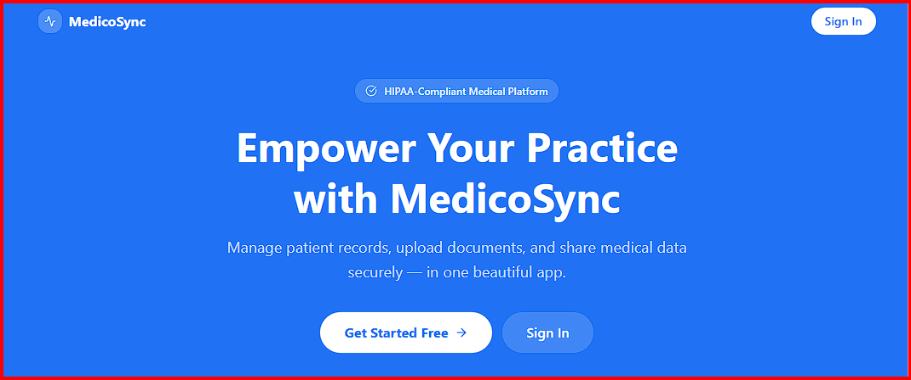

# MedicoSync — Secure Healthcare Backend Core




---

> **Doctors lose time and risk losing patient history because records live in scattered photos and notebooks instead of one searchable, safe place.**

> **This rebuild is my attempt to solve that problem from first principles — starting with the doctor's workflow, then designing the data model, security boundaries, concurrency behavior, and infrastructure around what the system actually needs.**

---

## 🧠 Architectural Engineering Case Study

MedicoSync is a secure healthcare records backend being re-architected from first principles.

Instead of chasing technology hype or adding features for the sake of complexity, each architectural decision is tied back to a real operational bottleneck.

The rebuild follows a deliberate engineering loop:

```text
Real-World Problem
       ↓
System Design
       ↓
Implementation
       ↓
Testing
       ↓
Load Testing
       ↓
Failure Analysis
       ↓
Refinement
       ↓
Validation
       ↓
Merge to main
```

### 📰 Rebuilding My Healthcare App From Scratch

This is a step-by-step engineering journal documenting how MedicoSync is being redesigned, implemented, tested, broken, measured, and deployed.

### Episode 1 — The Problem I Almost Missed

**Focus:** Turning an amorphous "bad record management" problem into a strict v1 system flow:

**Search → Capture → Retrieve**

The episode explores the doctor's real workflow, the three underlying operational problems, why retrieval speed became the v1 priority, and how the North Star requirement was translated into system behavior.

→ [Read the full case study on Medium](https://medium.com/@adilkhan.code/case-study-rebuilding-my-healthcare-app-from-scratch-the-problem-i-almost-missed-4dd3f86ef033)

### Episode 2 — Building, Breaking, and Deploying Auth

**Focus:** Taking authentication through the complete engineering loop:

**Compliance → Test Cases → OOP → Implementation → Integration Testing → Redis → Load Testing → Deployment**

The rebuild introduced focused authentication components, PostgreSQL-backed persistence, dependency injection, Redis-backed shared state, account-level lockout handling, refresh-token state, and production deployment.

Load testing also exposed an important CPU ceiling: approximately **6.0 → 6.2 RPS despite 4× workers**, with CPU reaching 100% during the heavier run. The bottleneck was traced to Argon2's intentional CPU cost rather than insufficient application workers.

→ [Read the full case study on Medium](https://medium.com/@adilkhan.code/medicosync-rebuild-episode-2-building-breaking-and-deploying-auth-4c26eeb1440e)

---

## 🚧 Current Rebuild Status

The MedicoSync rebuild is being developed incrementally through feature branches.

Each feature is implemented, tested, load-tested where relevant, and validated before being merged into `main`.

### Current Feature

`feature/auth-rebuild`

**Status:** Deployed and validated on Render; PR to `main` not yet opened — working code still lives in flat sandbox files, pending reorganization into the layered structure below before merge.

The current rebuild includes:

- OOP-based authentication components with focused responsibilities
- PostgreSQL-backed user persistence
- Native PostgreSQL enums for constrained user fields
- Dependency injection
- Request-scoped database sessions
- Unit and integration testing
- Redis-backed shared authentication state
- Account-level lockout handling across multiple workers
- Refresh-token state management
- Locust load testing
- Dockerized deployment validation

> **Placeholder:** This section is intentionally updated as the rebuild progresses. Once the current feature is validated and merged into `main`, this section will point to the next active feature branch.

---

# 🎯 Product Problem

MedicoSync started from a real-world observation.

A local doctor was managing patient records across:

```text
Personal Smartphone
       +
Physical Notebook
```

This created three distinct problems:

1. **Retrieval bottleneck** — finding a patient's history quickly during consultation.
2. **Data-loss risk** — losing a phone could mean losing historical patient records.
3. **Sharing friction** — sending records to another doctor required physically sharing the device or files.

For the first version, the priority was narrowed to the problem that occurred every day:

> **Doctors lose time and risk losing patient history because records live in scattered photos and notebooks instead of one searchable, safe place.**

That became the system's North Star.

---

# 🔄 V1 System Flow

The initial product flow is deliberately small:

```text
SEARCH
  ↓
Find the correct patient
  ↓
CAPTURE
  ↓
Attach clinical records to the patient
  ↓
RETRIEVE
  ↓
View recent and relevant medical history
```

The retrieval layer is designed around:

- Patient identity
- Contextual search
- Record categories
- Descending chronological order
- Pagination
- Strict doctor ownership

A two-year patient history should not require the client to load hundreds of high-resolution files at once.

---

# 🏗️ Architecture

## Current Stable Architecture

The stable MedicoSync implementation follows a five-layer request architecture.

```text
Layer 1 → Router
           ↓
Layer 2 → Controller
           ↓
Layer 3 → Service
           ↓
Layer 4 → Repository
           ↓
Layer 5 → Database
```

Each layer has one responsibility:

| Layer | Responsibility |
|---|---|
| Router | HTTP request/response handling |
| Controller | Request flow and transaction coordination |
| Service | Business logic |
| Repository | Database queries |
| Database | Persistent data |

The goal is to keep framework concerns, business rules, persistence, and storage responsibilities separated.

---

# 🔐 Security Model

Healthcare data requires security boundaries to be part of the architecture rather than an afterthought.

The current system includes:

- JWT authentication
- Argon2 password hashing
- Doctor-scoped authorization
- UUID-based resource identifiers
- Private object storage
- Time-limited presigned URLs
- OTP-protected record sharing
- HMAC-SHA256 OTP hashing
- Constant-time OTP comparison
- Rate-limited OTP resend
- Maximum OTP verification attempts
- Atomic OTP attempt updates
- Restricted CORS
- Production `DEBUG=False`
- Secret scanning with Gitleaks

---

# 👤 Multi-Tenant Data Isolation

Every patient and medical record belongs to a specific doctor.

The ownership boundary is derived from the authenticated identity rather than accepting ownership information from the request body.

Conceptually:

```text
Authenticated JWT
       ↓
Current Doctor
       ↓
Ownership Check
       ↓
Patient / Record Query
       ↓
Only Authorized Data
```

This prevents one doctor's authenticated session from simply requesting another doctor's records by changing an identifier.

The rebuild is taking this boundary further by explicitly testing ownership behavior and database access patterns under the new architecture.

---

# 🔑 Authentication Architecture

The authentication rebuild is being designed as a set of focused components rather than one large authentication module.

Conceptually:

```text
                AuthOrchestrator
                       │
        ┌──────────────┼──────────────┐
        ↓              ↓              ↓
PasswordHandler  SessionManager  TokenGenerator
        │              │              │
        ↓              ↓              ↓
     Argon2          Redis          JWT / Refresh
                       │
                       ↓
                UserRepository
                       │
                       ↓
                  PostgreSQL
```

The rebuild uses dependency injection so components can be tested independently and replaced without hardcoding infrastructure dependencies.

Database sessions are created per request rather than shared globally across concurrent requests.

---

# 🧪 Testing Strategy

Testing is treated as an engineering design activity rather than an implementation afterthought.

The rebuild follows:

```text
Requirement
    ↓
Failure Scenario
    ↓
Test Case
    ↓
Implementation
    ↓
Integration Test
    ↓
Load Test
    ↓
Observed Behavior
    ↓
Refinement
```

The current authentication rebuild contains:

- **25 unit tests**
- **8 integration tests**
- Real PostgreSQL-backed integration behavior
- Stateful session-manager testing
- Redis-backed state testing
- Load testing with Locust

A key testing principle from the rebuild:

> **AI can help write test syntax. The engineer still has to decide what behavior is actually worth testing.**

Exact error messages, timing behavior, and third-party library behavior are verified against the real implementation rather than assumed.

---

# ⚡ Concurrency & Shared State

The original authentication implementation used an in-memory Python dictionary for state such as lockout counters and refresh tokens.

That approach breaks when:

1. The process restarts.
2. Multiple Uvicorn workers are running.

Each worker would otherwise maintain its own independent memory state.

```text
                 Application
                     │
          ┌──────────┼──────────┐
          ↓          ↓          ↓
       Worker 1   Worker 2   Worker 3
          │          │          │
       Dict A      Dict B      Dict C
```

A user's failed login attempt on Worker 1 would not necessarily be visible to Worker 2.

Redis provides shared state:

```text
Worker 1 ──┐
Worker 2 ──┼──→ Redis
Worker 3 ──┘
```

The rebuild uses:

- `INCR` for atomic counters
- `EXPIRE` for automatic cleanup
- Redis hashes for structured refresh-token state

Tests use an isolated Redis database and clean state before and after execution.

---

# 📊 Load Testing

Locust was used to test the rebuilt authentication service.

The first major finding was that adding workers did not meaningfully increase throughput:

```text
Workers       RPS

1             ~6.0
4             ~6.2
```

During the heavier run, CPU remained at approximately 100%.

The bottleneck was traced to Argon2 password hashing.

This is expected behavior from a deliberately expensive password hashing algorithm.

The lesson:

> **More application workers cannot manufacture additional CPU capacity.**

If the workload becomes CPU-bound, the relevant scaling options become:

- Vertical scaling
- Horizontal scaling
- Workload separation
- Capacity planning
- Architectural changes where appropriate

The important result of the test was not the raw RPS number.

It was identifying the actual bottleneck before attempting to optimize the wrong layer.

---

# ☁️ Deployment

The current application is deployed across:

```text
Frontend
   │
   ▼
Netlify

Backend
   │
   ▼
Render

Database
   │
   ▼
Supabase PostgreSQL
```

The rebuilt authentication service is deployed with Docker and GitHub Actions.

The backend and database are deployed in the same geographical region to avoid unnecessary cross-region network latency.

The rebuild also involved real deployment debugging, including:

- Docker path issues
- Linux compatibility problems
- Database driver configuration
- URL encoding for database credentials
- Production environment configuration

---

# 🗂️ Current Stable Technology Stack

| Layer | Technology |
|---|---|
| Frontend | Vanilla HTML5, CSS3, JavaScript ES6+ |
| Backend | FastAPI, Python 3.13 |
| ORM | SQLAlchemy 2.0 Async |
| Validation | Pydantic v2 |
| Database | PostgreSQL / Supabase |
| Migrations | Alembic |
| Authentication | JWT, Argon2 |
| Shared State | Redis |
| Object Storage | MinIO / AWS S3 |
| Background Processing | AWS SQS |
| Testing | Pytest |
| Load Testing | Locust |
| Containerization | Docker / Docker Compose |
| CI/CD | GitHub Actions |
| Backend Deployment | Render |
| Frontend Deployment | Netlify |

---

# 🗄️ Database Model

The current stable schema contains:

| Table | Primary Key | Purpose |
|---|---|---|
| `users` | UUID | Doctor accounts |
| `patients` | UUID | Patient profiles |
| `medical_records` | UUID | Clinical file metadata and storage references |
| `share_links` | UUID | OTP-protected sharing state |

Relationships:

```text
users
  │
  ├──────────────┐
  ↓              ↓
patients    share_links
  │              ↑
  ↓              │
medical_records ─┘
```

Patient and medical record ownership is tied to the authenticated doctor.

---

# 📡 Stable API Surface

The current deployed API includes:

```text
AUTH
POST   /auth/register
POST   /auth/login

PATIENTS
POST   /patients/
GET    /patients/
GET    /patients/{id}
DELETE /patients/{id}

RECORDS
POST   /records/
GET    /records/{id}
GET    /records/patient/{id}
DELETE /records/{id}

SHARES
POST   /shares
POST   /shares/verify
POST   /shares/resend

DASHBOARD
GET    /dashboard
```

Interactive Swagger documentation:

→ [Open API Docs](https://medicosync-backend.onrender.com/docs)

---

# 📦 Core Features

### Authentication

- JWT authentication
- Argon2 password hashing
- Configurable token expiry
- Active-user validation
- Refresh-token handling in the rebuilt authentication system

### Patient Management

- Patient CRUD
- Doctor-scoped access
- UUID identifiers
- Search and retrieval designed around the v1 workflow

### Medical Records

- Clinical file uploads
- PDF, JPEG, and PNG support
- Private object storage
- Database metadata
- Presigned download URLs
- Record-to-patient relationships

### Secure Sharing

- Unique share tokens
- 6-digit OTP verification
- HMAC-SHA256 OTP protection
- Attempt limits
- Rate-limited resend
- Time-limited file access

---

# 🔒 Security Architecture

| Threat | Defence |
|---|---|
| Password theft | Argon2 memory-hard hashing |
| Token forgery | Signed JWT with server secret |
| OTP brute force | Attempt limit + rate-limited resend |
| OTP database exposure | HMAC-SHA256 + server secret |
| Timing attacks | Constant-time comparison |
| Resource enumeration | UUID identifiers |
| Cross-doctor access | JWT-derived doctor ownership |
| Direct file access | Private S3 + presigned URLs |
| Stack trace exposure | `DEBUG=False` in production |
| Credential leaks | Gitleaks scanning |

CORS is restricted to the production frontend domain.

---

# 🧱 Project Structure

```text
medicosync/
├── backend/
│   ├── app/
│   │   ├── api/
│   │   ├── controllers/
│   │   ├── services/
│   │   ├── repository/
│   │   ├── models/
│   │   ├── schemas/
│   │   └── core/
│   ├── migrations/
│   ├── tests/
│   ├── main.py
│   ├── requirements.txt
│   ├── Dockerfile
│   ├── alembic.ini
│   └── pytest.ini
│
├── frontend/
│   ├── static/
│   │   ├── css/
│   │   └── js/
│   ├── img/
│   ├── index.html
│   └── dashboard.html
│
├── docker-compose.yml
├── .dockerignore
├── .gitignore
├── LICENSE
└── README.md
```

> The rebuild is currently reorganizing the working code toward this layered structure. The repository structure will continue evolving as individual features are rebuilt and validated.

---

# ⚙️ Local Setup

## Prerequisites

- Python 3.13+
- Node.js 20+
- Docker + Docker Compose
- PostgreSQL database

## Backend

```bash
git clone https://github.com/FanoyG/medicosync.git
cd medicosync/backend

python -m venv venv

# macOS / Linux
source venv/bin/activate

# Windows
venv\Scriptsctivate

pip install -r requirements.txt

cp .env.example .env

alembic upgrade head

uvicorn main:app --reload
```

### Backend environment

```text
DATABASE_URL
SECRET_KEY
ALGORITHM
ACCESS_TOKEN_EXPIRE_MINUTES
S3_ENDPOINT_URL
S3_ACCESS_KEY
S3_SECRET_KEY
S3_BUCKET_NAME
OTP_SECRET
DEBUG
```

## Frontend

```bash
cd medicosync/frontend

npm install

cp .env.example .env.local

npm run dev
```

Environment:

```text
VITE_API_URL
```

## Docker

From the project root:

```bash
docker compose up --build
```

---

# 🔗 Live Project

- [MedicoSync Frontend](https://medicosync-frontend.netlify.app/)
- [MedicoSync API](https://medicosync-backend.onrender.com/)
- [Interactive Swagger Docs](https://medicosync-backend.onrender.com/docs)
- [GitHub Repository](https://github.com/FanoyG/medicosync)

---

# 🧭 Engineering Principles

The rebuild is guided by a few principles:

### 1. Start with the problem

Technology choices come after understanding the actual workflow.

### 2. Make boundaries explicit

Authentication, ownership, persistence, and business logic should have clear responsibilities.

### 3. Test behavior, not implementation trivia

Tests should prove meaningful system behavior rather than merely increase coverage numbers.

### 4. Measure before optimizing

Load testing is used to identify actual bottlenecks before changing architecture.

### 5. Treat concurrency as a design concern

State that works in one process may fail immediately across multiple workers.

### 6. Prefer explicit failure over silent corruption

When the system cannot confidently determine something, it should fail safely or request human intervention rather than silently make an unsafe assumption.

### 7. Validate before merging

Each rebuild feature follows:

```text
Build
 ↓
Test
 ↓
Break
 ↓
Measure
 ↓
Fix
 ↓
Deploy
 ↓
Validate
 ↓
Merge
```

---

# 📜 License

MIT License — Copyright (c) 2026 Adil Khan

Permission is hereby granted, free of charge, to any person obtaining a copy of this software to use, copy, modify, merge, and distribute it, subject to the condition that this copyright notice is included in all copies.